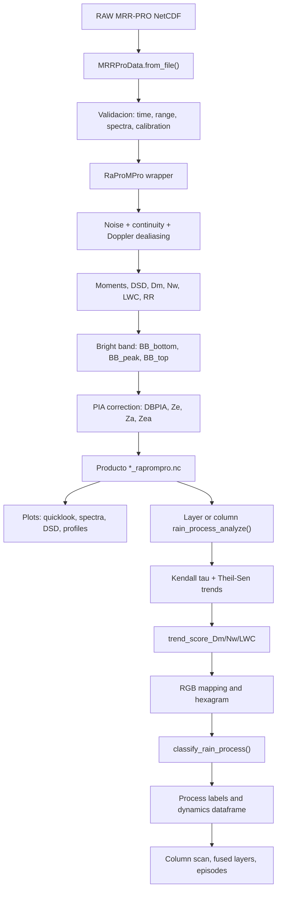

# Informe para poster cientifico de mrrpropy

Fecha de analisis: 2026-06-03  
Repositorio analizado: `C:\Users\Fizico\Documents\github\mrrpropy`

## 1. Arquitectura general del software

`mrrpropy` es un paquete Python para carga, procesado RaProMPro, visualizacion y analisis microfisico de datos METEK MRR-PRO. La API publica esta concentrada en `mrrpropy.raw_class.MRRProData`, que encapsula:

- `ds`: dataset RAW abierto con `xarray`.
- `raprompro`: producto procesado RaProMPro, generado o cargado desde NetCDF.
- `micro_cfg`: configuracion de analisis de procesos de lluvia.
- `plot_cfg`: configuracion comun de figuras.

Arquitectura por modulos:

- `mrrpropy/raw_class.py`: fachada de alto nivel. Expone carga RAW, subsetting, perfiles, espectros, procesado, plots y analisis de procesos.
- `mrrpropy/processing/raprompro.py`: wrapper xarray del nucleo cientifico RaProMPro. Convierte datos CF/Radial MRR-PRO en productos microfisicos.
- `mrrpropy/RaProMPro_original.py`: implementacion cientifica original conservada como referencia.
- `mrrpropy/RaProMPro_optimized.py`: implementacion optimizada usada por el wrapper canonico.
- `mrrpropy/analysis/processes.py`: analisis de tendencias verticales, clasificacion de procesos, dataframes dinamicos, escaneo de columna y deteccion de episodios.
- `mrrpropy/analysis/process_features.py`: construccion de `process_features` en dos fases: rasgos microfisicos, espectrales y de contexto.
- `mrrpropy/hexagram.py`: generacion de hexagramas RGB, mapeo RGB a celdas y mascaras teoricas por proceso.
- `mrrpropy/processes.py`: metadatos compartidos de procesos, firmas de clasificacion, codigos y marcadores.
- `mrrpropy/plotting/`: funciones de visualizacion RAW, espectral, procesada y de procesos.
- `mrrpropy/cli/main.py`: CLI minima (`mrrpropy version`).
- `scripts/` y `workbench/scripts/`: cadenas reproducibles para procesar ficheros, generar quicklooks, analisis de capas y escaneos de columna.
- `tests/`: tests unitarios, integracion y regresion visual. Los tests de `tests/rain_processes/` documentan el flujo cientifico de procesos.

## 2. Flujo de procesado desde RAW hasta productos finales

Flujo principal:

1. Apertura del RAW con `MRRProData.from_file(path)`.
2. Validacion minima del dataset: coordenadas `time` y `range`, variables espectrales `spectrum_raw` o `spectrum_reflectivity`, `transfer_function`, `calibration_constant`, `index_spectra` y `D`.
3. Calculo de constantes radar y ejes Doppler: resolucion temporal, rango, `DeltaH`, longitud de onda, frecuencia de Nyquist, diametros de gota y secciones de scattering/extincion Mie.
4. Reconstruccion de espectros por tiempo-altura usando `index_spectra(time, range) -> n_spectra`.
5. Eliminacion de ruido y continuidad vertical con `MrrProNoise2()` y `Continuity()`.
6. Procesado espectral central con `RaProMPro_optimized.Process()`: dealiasing, momentos Doppler, DSD y variables microfisicas.
7. Deteccion y suavizado de bright band con `BB2()`, `Inter1D()` y `anchor()`.
8. Correccion por atenuacion integrada en trayectoria (`DBPIA`), aplicada de forma selectiva a hidrometeoros liquidos (`Type` 5 y 10).
9. Construccion de un `xarray.Dataset` con variables 2D, bright band y productos opcionales 3D (`spe_3D`, `dsd_3D`).
10. Guardado opcional a `*_raprompro.nc`.
11. Analisis posterior: quicklooks, perfiles, DSD, espectrogramas, tendencias microfisicas, hexagramas RGB, clasificacion de procesos y deteccion de episodios.

El RAW de prueba versionado tiene dimensiones representativas `time=61`, `range=128`, `n_spectra=128` y `spectrum_n_samples=64`, con variables como `Ze`, `RR`, `LWC`, `PIA`, `VEL`, `WIDTH`, `SNR`, `index_spectra`, `spectrum_raw`, `N` y `D`.

## 3. Variables principales generadas

Variables RaProMPro 2D (`time`, `range`):

- `Type`: codigo de tipo hidrometeorico predominante.
- `W`: velocidad de caida corregida por aliasing.
- `spectral width`: anchura espectral.
- `Skewness`, `Kurtosis`: momentos espectrales superiores.
- `DBPIA`: path-integrated attenuation en dB.
- `LWC`: contenido de agua liquida usando solo hidrometeoros liquidos.
- `RR`: rain rate usando solo hidrometeoros liquidos.
- `SR`: snow rate.
- `Za`: reflectividad atenuada corregida por PIA solo en hidrometeoros liquidos.
- `Zea`: reflectividad equivalente atenuada.
- `Ze`: reflectividad equivalente corregida por PIA para llovizna/lluvia.
- `Z_all`: reflectividad corregida asumiendo fase liquida en todos los hidrometeoros.
- `LWC_all`, `RR_all`, `N_all`: variables equivalentes asumiendo todo liquido.
- `Nw`, `Dm`: parametro de intercepto normalizado y diametro medio ponderado por masa usando `Type`.
- `Nw_all`, `Dm_all`: equivalentes bajo hipotesis todo-liquido.
- `Noise`, `SNR`, `N_da`: ruido, SNR y distribucion de tamanos derivada.

Variables bright band:

- `BB_bottom`, `BB_top`, `BB_peak`: base, techo y pico de la banda brillante.

Productos opcionales 3D:

- `spe_3D` (`time`, `range`, `speed`): reflectividad espectral dealiased.
- `dsd_3D` (`time`, `range`, `DropSize`): distribucion de tamanos de gota en log10.

Variables de analisis de procesos:

- Tendencias: `tau_Dm`, `tau_Nw`, `tau_LWC`, `p_*`, `ts_*`, `intercept_ts_*`.
- Campos canonicos: `trend_mag_*`, `trend_sign_*`, `trend_strength_*`, `trend_score_*`, `trend_p_*`.
- RGB y hexagrama: `R`, `G`, `B`, `minutes`, `hex_x`, `hex_y`, `hex_area`.
- Clasificacion: `proc_label`, `strength`, `sign_R`, `sign_G`, `sign_B`.
- Dataframes: `Dm_top`, `Dm_bottom`, `Dm_delta`, `Dm_delta_pct`, `Dm_rate_per_km` y analogos para `Nw` y `LWC`; `window_id`, `z_min_m`, `z_max_m`, `z_center_m` en escaneos.

## 4. Algoritmos implementados para deteccion o clasificacion de procesos de precipitacion

### Procesado RaProMPro

- Correccion de ruido por perfil espectral con `MrrProNoise2`.
- Filtro de continuidad vertical con `Continuity`.
- Correccion de aliasing Doppler con `Aliasing`.
- Calculo de momentos Doppler: velocidad de caida, anchura espectral, skewness y kurtosis.
- Estimacion DSD y parametros microfisicos (`Dm`, `Nw`, `LWC`, `RR`, `SR`).
- Deteccion de bright band con `BB2` usando velocidad, reflectividad, skewness y kurtosis.
- Correccion PIA/transmitancia con separacion por tipo hidrometeorico.
- Clasificacion interna de tipo hidrometeorico y regimen de precipitacion en el nucleo RaProMPro, incluyendo `PrepType(dm, nw)` para separar regimenes convectivo/transicion/estratiforme en el espacio `Dm`-`Nw` dentro del codigo de referencia.

### Analisis no parametrico de procesos microfisicos

La ruta recomendada usa tendencias verticales no parametricas:

- Kendall tau para direccion y consistencia monotona de cambio dentro de una capa.
- Pendiente Theil-Sen para magnitud robusta.
- Convencion fisica: una tendencia positiva significa aumento al descender desde `z_top_m` hacia `z_bottom_m`.
- Umbral de senal por `Ze > ze_th` y minimo de puntos validos (`min_points_trend`).
- Campos canonicos independientes del metodo: `trend_sign_*`, `trend_strength_*`, `trend_score_*`.

Existe una ruta OLS heredada para comparacion diagnostica:

- Ajuste log-lineal por minimos cuadrados.
- `r2` usado como fuerza de tendencia.
- Campos canonicos equivalentes para mantener la compatibilidad aguas abajo.

### Clasificacion por firmas microfisicas

La clasificacion usa el signo de las tendencias de `Dm`, `Nw` y `LWC`, con RGB semantico:

- `R = Dm`
- `G = Nw`
- `B = LWC`

Firmas implementadas en `mrrpropy/processes.py`:

| Proceso | Firma `(Dm, Nw, LWC)` |
|---|---|
| `breakup` | `(-1, +1, 0)` |
| `growth_depletion` | `(+1, -1, 0)` |
| `growth_depletion_gain` | `(+1, -1, +1)` |
| `growth_depletion_loss` | `(+1, -1, -1)` |
| `evaporation` | `(-1, -1, -1)`, `(-1, -1, 0)`, `(-1, 0, -1)` |
| `growth` | `(+1, 0, +1)` |
| `activation` | `(+1, +1, +1)`, `(0, +1, +1)` |

Muestras con fuerza insuficiente o p-value no aceptado se etiquetan como `steady_or_weak`; muestras no validas como `no_data`; patrones no recogidos como `unknown`.

### Hexagrama RGB

- `build_rgb_from_unit_scores()` transforma `trend_score_*` de `[-1, 1]` a canales RGB `[0, 1]`.
- `generate_rgb_hex(k)` genera la rejilla RGB del hexagrama.
- `map_rgb_to_hexagram()` asigna cada muestra a la celda RGB mas cercana.
- `get_process_hexagram_mask()` genera mascaras teoricas de cada proceso sobre el hexagrama.
- `plot_classified_processes_on_hexagram()` combina muestras clasificadas, fondo RGB y mascaras de procesos.

### Escaneo de columna y episodios

- `build_column_process_scan_dataframe()` recorre la columna con ventanas verticales deslizantes (`window_thickness_m`, `window_step_m`).
- En cada ventana ejecuta el mismo analisis de tendencias y clasificacion.
- `detect_column_process_episodes()` detecta episodios persistentes por ventana cuando un proceso aparece en perfiles consecutivos.
- `build_fused_column_process_dataframe()` fusiona detecciones verticalmente adyacentes del mismo proceso y recomputa tendencias en la capa fusionada.

## 5. Modulos relacionados con `rain_processes`

No existe un paquete fuente llamado literalmente `mrrpropy/rain_processes`; el nombre aparece principalmente en tests. Los modulos funcionales equivalentes son:

- `mrrpropy/analysis/processes.py`: nucleo de `rain_process_analyze`, `classify_rain_process`, escaneo de columna, episodios y dataframes.
- `mrrpropy/analysis/process_features.py`: extraccion de rasgos para clasificacion por fases.
- `mrrpropy/hexagram.py`: RGB/hexagrama y mascaras teoricas por proceso.
- `mrrpropy/processes.py`: firmas y metadatos de procesos.
- `mrrpropy/plotting/processes.py`: figuras de procesos, hexagramas, cortinas de columna, scatter y quicklooks fusionados.
- `mrrpropy/raw_class.py`: metodos publicos que delegan en los modulos anteriores.

Tests relacionados:

- `tests/rain_processes/test_analysis_and_classification.py`
- `tests/rain_processes/test_trend_stats.py`
- `tests/rain_processes/test_process_fixed_layer_plots.py`
- `tests/rain_processes/test_process_scan_plots.py`
- `tests/rain_processes/test_plot_fused_process_quicklook.py`
- `tests/rain_processes/test_fused_column_process_dataframe.py`
- `tests/rain_processes/get_features/test_micro_features.py`
- `tests/rain_processes/get_features/test_spectral_features.py`
- `tests/rain_processes/get_features/test_context_features.py`

## 6. Figuras ya existentes reutilizables para un poster

Figuras versionadas y directamente reutilizables:

1. `docs/assets/hero_quicklook_ze.png`
   - Tamano: 1600 x 800 px.
   - Contenido: quicklook representativo de `Ze`.
   - Uso sugerido: panel "RAW/processed quicklook" o fondo visual de flujo de procesado.

2. `docs/assets/hexagram_classification_example.png`
   - Tamano: 2416 x 1932 px.
   - Contenido: ejemplo de clasificacion de procesos sobre hexagrama RGB.
   - Uso sugerido: panel central de metodologia de clasificacion microfisica.

Figuras generables por scripts, no necesariamente versionadas:

- Quicklooks RAW/procesados: `*_raw_Ze_quicklook.png`, `*_raprompro_Ze_quicklook.png`.
- Espectros y espectrogramas: `*_spectrum_*.png`, `*_spectra_by_range_*.png`, `*_spectrogram_*.png`.
- DSD: `*_DSDgram_*.png`, `*_DSD_by_range_*.png`.
- Perfiles microfisicos: `*_RaProMPro-preprocessed_profiles.png`.
- Correccion PIA: `transmittance_correction_consistency.png`, `transmittance_correction_quicklook.png`.
- Procesos de lluvia: `rain_process_hex_*.png`, `processes_evolution_*.png`, `classified_processes_hexagram_*.png`.
- Escaneo de columna: `column_process_scan_*.png`, `column_process_events_hexagram_*.png`.
- Fusion de eventos: `fused_process_quicklook_*.png`.
- Comparaciones scatter: `scan_process_scatter_compare_*.png`.

## 7. Notebooks o ejemplos demostrativos

Notebook versionado:

- `mrrpropy/RGB_hexagram_tutorial_for_generation.ipynb`
  - Tutorial de generacion de hexagramas RGB basado en Kondo (2025).
  - Contiene secciones para crear arrays RGB, visualizar el hexagrama, cargar CSV y proyectar datos 3D de muestra.

Script equivalente:

- `mrrpropy/RGB_hexagram_tutorial_for_generation.py`

Documentacion con ejemplos:

- `docs/getting-started.html`: carga RAW, carga/generacion de producto RaProMPro y quicklook de `Ze`.
- `docs/examples.html`: quicklook, espectro Doppler, espectrograma y analisis de procesos microfisicos.
- `docs/processing-workflow.html`: flujo RAW -> RaProMPro -> analisis de procesos.

Scripts reproducibles:

- `scripts/run_daily_chain.py`: cadena completa para un dia: procesado, plots RAW/procesados, analisis de capa y escaneo de columna.
- `scripts/run_single_hour.py`: cadena equivalente para un fichero horario.
- `scripts/benchmark_raprompro.py`: benchmark del procesado canonico.
- `scripts/create_raw_subset.py`: creacion de fixture RAW reducido.
- `workbench/scripts/process_one_raprompro.py`: procesar un fichero.
- `workbench/scripts/process_daily_raprompro.py`: procesado batch.
- `workbench/scripts/plot_daily_quicklooks.py`: quicklooks diarios.
- `workbench/scripts/plot_one_raprompro_quicklooks.py`: quicklooks de un producto.
- `workbench/scripts/plot_sampled_profiles.py`: perfiles muestreados.
- `workbench/scripts/plot_rain_classification_regions.py`: figuras de regiones de clasificacion.
- `workbench/scripts/plot_rain_process_regression_details.py`: detalles OLS/regresion para diagnostico.
- `workbench/scripts/plot_raprompro_histogram.py`: histogramas de variables procesadas.

No se encontraron carpetas versionadas `examples/` ni `notebooks/` en la raiz del repositorio.

## 8. Resultados cientificos mas destacables

El repositorio es principalmente una herramienta metodologica; no contiene un analisis cientifico final de campana listo para citar como resultado observacional. Los resultados destacables para un poster deben formularse como capacidades cientificas reproducibles:

- Implementacion MRR-PRO de la metodologia RaProMPro asociada a Garcia-Benadi et al. (2021), orientada a caracterizacion de bright band con momentos espectrales Doppler.
- Procesado end-to-end de espectros MRR-PRO hasta reflectividad corregida, DSD, lluvia, agua liquida, velocidad de caida, momentos espectrales y bright band.
- Correccion explicita de atenuacion integrada (`DBPIA`) y comparacion `Ze - Zea` para hidrometeoros liquidos.
- Separacion de variables "por tipo hidrometeorico" frente a "todo liquido" (`Dm/Nw/LWC/RR` vs `*_all`).
- Clasificacion de procesos microfisicos de precipitacion basada en tendencias verticales de `Dm`, `Nw` y `LWC`.
- Sustitucion de OLS como metodo por defecto por Kendall tau + Theil-Sen, mas robusto frente a outliers y perfiles no lineales.
- Proyeccion RGB/hexagrama de las firmas microfisicas, util para comunicar visualmente crecimiento, evaporacion, activacion, ruptura y depletion.
- Escaneo de columna con ventanas deslizantes y deteccion de episodios persistentes, lo que permite pasar de diagnosticos de capa fija a estructuras tiempo-altura.

Referencias cientificas documentadas en el repositorio:

- Garcia-Benadi A, Bech J, Gonzalez S, Udina M, Codina B. 2021. *A New Methodology to Characterise the Radar Bright Band Using Doppler Spectral Moments from Vertically Pointing Radar Observations*. Remote Sensing 13(21):4323. https://doi.org/10.3390/rs13214323
- Garcia-Benadi A, Bech J, Gonzalez S, Udina M, Codina B, Georgis JF. 2020. *Precipitation Type Classification of Micro Rain Radar Data Using an Improved Doppler Spectral Processing Methodology*. Remote Sensing 12(24):4113. https://doi.org/10.3390/rs12244113

## 9. Diagrama de flujo simplificado del paquete

## 10. Lista de figuras PNG, JPG, PDF y SVG existentes en `docs`, `examples` o `notebooks`

Busqueda acotada a `docs/`, `examples/` y `notebooks/`:

| Ruta | Formato | Tamano |
|---|---:|---:|
| `docs/assets/hexagram_classification_example.png` | PNG | 2416 x 1932 px |
| `docs/assets/hero_quicklook_ze.png` | PNG | 1600 x 800 px |

No se encontraron ficheros `.jpg`, `.jpeg`, `.pdf` ni `.svg` en esas rutas. Tampoco existen carpetas versionadas `examples/` o `notebooks/` en la raiz del repositorio; el notebook existente esta en `mrrpropy/RGB_hexagram_tutorial_for_generation.ipynb`.

